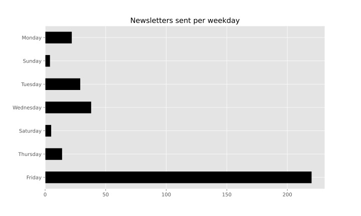

   

# Predicting Open Rates and Click-to-Open Rates for Newsletters Using Keywords in the Subject

### Overview

This project was completed as part of the General Assembly Data Science Immersive bootcamp. This document discusses the problem, hypothesis, methodology, conclusion, and tools used.

### Repository Contents

* Notebooks:
* Sub CTOR newsletter
* Sub OR newsletter
* Images
* Saved models
* Saved plot PDFs
* Read Me

Please note the data files are not included.

### Problem Statement

Email marketing is used by many companies and industries allowing them to build a direct relationship with their users. They can be time-consuming to plan and construct but the right messaging can make a big impact. 

I would like to know if we can find the keywords that give the business their desired impact of a higher open-rate or a higher click-to-open rate by looking at the subject of the newsletter.
In this scenario, the business is an international genre-specific music news portal.

Definitions:
* Open-rate (OR) : the rate of opened emails out of total delivered
* Click-to-open rate (CTOR) :  the rate of people that open an email but also click a link in the newsletter. It is a strong indicator of the effectiveness of the campaign. Total unique clicks divided by total unique opens
* Click-rate (CR) : Total number of clicks divided by number of emails delivered

### Objectives

My objective for this project is to: 

* Predict high OR and CTOR
* Identify keywords and therefore user segmentation & behaviour
* Provide insights to the business to aid in reaching their email marketing goals

### Hypothesis

My hypothesis is that users will be more engaged with the newsletter if it covers a specific topic or artist.

From a user point of view, you may be receiving several newsletters a day. The decision to open an email often comes from glancing at the subject of the newsletter, or perhaps even just the first few words that are visible depending on the set up of your email. Those words will be the deciding factor on whether or not you open an email.

Similarly, once the email is opened, it may come down to the title of the linked article or site that will determine whether or not it is clicked.

The keywords we spot are a determining factor for a good OR and CTOR.

There are of course other factors at play such as demographics, position of the content within the email, time of day, and more, but those are beyond the scope of this project, as that information was not available in the current data set.

### Background

Email marketing is used to promote a business, whether that be a product or service. It is also a key tool in strengthening the company brand and the relationship between the business and the user.

At first, email was just a system for internal communication to help with company productivity and workflow; today, we send and receive over 319 billion emails a day and it is predicted that number will reach 376 billion by 20251.

OR and CTOR are important metrics when it comes to email marketing as it tells the business how engaged their users are with the content.

<a href url="https://www.statista.com/statistics/456500/daily-number-of-e-mails-worldwide/">1 - Statista - Number of sent and received emails per day worldwide from 2017 to 2025 - Joseph Johnson - 19 Oct 2021</a>

### Data Acquisition

The data acquisition for this project was straightforward. I used my network to search for a business that was willing to share data for the purposes of this capstone project without a problem statement in mind. I was kindly given access to a few marketing and social media dashboards and chose to work with the newsletter data.

From here, the acquisition was a simple case of loading the email history and exporting it to CSV.

### Data Cleaning & EDA

The data was relatively clean, there were no missing values but a few things to correct. All work was done in Python on Jupyter Notebooks. Here is a summary of the steps taken, I go into more detail below:

* Rates changed to numeric
* New feature for OR created
* Date column reformatted into datetime and day, month, and year extracted
* Remove outliers

The rates from the raw data were set up as “objects” or letters/characters rather than numbers. Changing these to numbers will make them easier to analyse. To do this, I remove the % symbol and convert them to a “float” or a decimal number.

The data set came with several metrics that counted either the user or the action. For example, clicked and total clicked. If 1 user clicks 10 times it counts as 1 in “clicked” but 10 in “total clicked”. When researching industry benchmarks there was only reference to an “open rate” but our data had “unique open rate” (opened / delivered) and both “opened” and “total opened”. While not wildly different, I assumed we needed to create a new variable for “open rate” (total opened / delivered).

The “sending date” column was also formatted as an “object” similar to the rates. In order to make this data usable in our analysis, I use Pandas to convert this column in a datetime format readable by Python allowing me to extract more information such as day of the week, month, and year.

| Column Name | Description |
| --- | ----------- |
| namefrom | Name of sender (company name) |
| sendingdate | Date newsletter was sent |
| subject | Subject of the newsletter |
| sent | Number of sent newsletters |
| nondelivered | Number of newsletters not delivered |
| hardbounces | Number of failed deliveries for permanent reasons (invalid email, closed account) |
| softbounces | Number of failed delivered for temporary reasons (account full) |
| nondeliveredrate | Total of Non Delivered / sent |
| delivered | Number of newsletters successfully delivered |
| totalopens | Total opens of an newsletter (counting multiple opens from same user) |
| opened | Total unique opens (counting one open per user) |
| uniqueopenrate | Opened / Delivered |
| totalclicked | Total clicks of a newsletter (counting multiple clicks from same user) |
| clicked | Total unique clicks (counting one click per user) |
| clickrate | Total Clicked / Delivered |
| click-to-openrate | Unique clicks / Unique opens |
| unsubscribed | Number of users who unsubscribed |
| unsupscriptionrate | Delivered / Unsubscribed |
| deliveredrate | Delivered / Sent |
| hardbouncesrate | Hard Bounces / Sent |
| softbouncesrate | Soft Bounces / Sent |
| complaints | Number of user complaints |
| complaintsrate | Complaints / Sent |
| day_of_week | Day of the week the newsletter was sent |
| month | Month the newsletter was sent |
| year | Year the newsletter was sent |
| openrate | Total opens / Delivered |
| stemmed_subject | Reformatted subject with stemmed words |

There were a few emails that had exceptionally low sent numbers compared to the rest, these are not really valuable for testing our hypothesis and we could assume that these were test emails and not part of the normal sending behavior. Additionally, there were some anomalies with the “non delivered” data. In some cases it provided a negative number implying that more emails were delivered than sent. In other cases, the number was very high and sometimes equal to the total sent implying that close to no one received that email. These outliers were all removed.

I will be reformatting the subject title column of the data for modelling, however, as this is done as part of a model pipeline we do not need to create these columns in advance. I still perform this action separately to explore the frequency of words. This is done with a stemmer and a CountVectorizer. 

A stemmer works by removing the endings of similar words for example: “science”, “scientist” would be reduced to “scien”. It also allows us to add something called stopwords, meaning we remove words such as “and”, “the”, “it” that do not add meaning to our work. In this project, I use both Portuguese and English stopwords as well as customizing our own entries.

A CountVectorizer works by creating a new column for every unique word that appears in our subject and then adding a 1 (or higher if the word appears more than once) or 0 if that word appeared in that particular newsletter subject.

After tallying up the frequency of words, I produced a WordCloud to visualize the results. Here the biggest words indicate a higher frequency, from left to right here we have a representation for the full company, business branch 1, and business branch 2:

Before I move to modelling, we explore some of the trends within the data including reviewing the sending behavior per year, month, and day. We can see in the graphs below that the company launched in 2016 but has since been relatively consistent with their sending behavior and the majority of their emails are sent on a Friday.

Finally, I see how this newsletter compares to the global benchmarks for email marketing. Here I do not include the benchmarking for 2021 as that year is not complete yet, and a reminder that our 2016 data is also an incomplete year.

A high click-to-open rate indicates that the content resonates strongly with your audience, specifically the ones that open their emails.

Unfortunately, this newsletter is underperforming when it comes to initial open rates, but the ones that do open are loving the content and very click happy!

Source: <a href url="https://dma.org.uk/uploads/misc/emailbenchmarkingreport2020.pdf">2015-2019 Email Benchmark Data</a>
Source: <a href url="https://www.campaignmonitor.com/resources/guides/global-email-benchmarks-archive/">2020 Email Benchmark Data</a>

|     |: Actual :|: Benchmark :|
| Year | OR | CR | CTOR | OR | CR | CTOR |
| --- | --- | --- | --- | --- | --- | --- |
| 2016 | 0.089 | 0.007 | 0.119 | 0.19 | 0.02 | 0.11 |
| 2017 | 0.091 | 0.014 | 0.230 | 0.19 | 0.02 | 0.11 |
| 2018 | 0.069 | 0.014 | 0.335 | 0.21 | 0.03 | 0.12 |
| 2019 | 0.056 | 0.009 | 0.267 | 0.2 | 0.02 | 0.12 |
| 2020 | 0.116 | 0.014 | 0.177 | 0.178 | 0.026 | 0.143 |

### Modelling

In the image above we see our OR and CTOR sit within quite a small range, I therefore decide to make this a classification problem by creating a flag for a high or low rate. This is done by first finding the mean, or average, rate and then anything above that is flagged as a high rate, or a 1, and anything below is a low rate, or 0.

It is worth noting that this data set is small, so we are expecting some variance issues to come up. To try to mitigate this from the beginning, we decide not to split our data into a training and test set but instead to use cross-validation which segments the data and runs the model for each segment. The cross-validation method will score our model using “roc-auc” which measures our models ability to distinguish between the two classes we have created (1 or high, 0 or low).

The modelling is done using a pipeline that includes a ColumnTransformer reformatting the newsletter subject as previously described with the CountVectorizer, and also a OneHotEncoder for the month variable that we decide to include. This creates a column for each month and adds a 1 in the column if the newsletter was sent in that month.

Note that day was not included in the modelling since we know from the EDA that most (66%) emails are sent on a Friday.

I run the following models first with all features (month, and subject) and then run all models two more times reducing the features each time, first without month, and second with a maximum of 50 word features:

* LogisticRegression
* DecisionTreeClassifier
* RandomForestClassifier
* KNN Classifier
* Naive Bayes Bernoulli
* Naive Bayes Multinomial

Here are the results. As expected with a small data-set we see a high variance in the scoring. Too many features and not enough data creates a risk of overfitting, or the model being too sensitive to the input data, resulting in a big range of results when training the model on unseen data (high variance). Normally this can be fixed with feature reduction, however that was not the case here so it is likely we will need more data to reduce that variance.

CTOR Modelling

OR Modelling

### Evaluation

To determine which model is best I want to have the least amount of variance and the highest score, remember that the scoring is “roc_auc” measuring our models ability to distinguish between the two classes we have created (1 or high, 0 or low). Looking at both of these metrics, I can determine that the best models are the Logistic Regression for the CTOR and Random Forest for the OR, both with all features included.

By reviewing the features of these models, I select a few words that appear to have a strong influence on the OR or CTOR. These are:

* resumo
* retrospectiva
* slipknot
* nervosa
* mustaine
* lennon

In order to check the robustness of our model, we take a closer look at the OR and CTOR rates specifically related to the appearance of these words. We do this by running a t-test and can conclude that these keywords successfully segment our users based on their open and click behavior.

### Findings

The features pulled from our two top models tell us a story. Both indicate "resumo" and "retrospectiva" as important features however with the Logistic Regression we can infer that the relationship there is negative. Upon closer inspection we can infer that these keywords have a positive influence on OR but a negative influence on CTOR indicating that readers have no interest in clicking further to the website. For example, a user may be opening an email interested in reading a recap of the news however, upon opening the email, realises they have already read all of the articles and does not click further.

We also investigate some artist names and find further segmentations. In all instances the effect on OR is always opposite to that of CTOR. Here, an example could be that only fans of that artist bother opening the email and once opened, they are keen to click through and read the latest news. 

### Limitations

In all cases we were unable to remove the variance in the modelling and after trying various feature reduction methods to do so we can conclude that the issue here is the size of the data set.

Aside from the size of the dataset, the biggest issue faced here is the language barrier given the data is in Portuguese. It is likely that more words can be added into the stopwords feature however given the engineer's limited knowledge of the language this was not done.

A better understanding of email marketing metrics would also be helpful.

### Conclusions 

The problem we set out to answer was to increase clicks to the website from the newsletter. As we didn't model on CR given the miniscule rate range there we focussed on OR and CTOR.

In real terms, the recommendation will need to be based on what the future business strategy will be and what to focus on. Having looked at where the business sits across email marketing benchmarks, perhaps a focus on improving the OR could be a good recommendation since the CTOR is over performing. In this case, although our results indicate that newsletters on "resumo" and "retrospectiva" negatively impact the CTOR, it does have a positive impact on OR.

To summarize, if the business wants more people to open their emails then a focus on news recaps may be helpful. Alternatively, if they want more people to engage with the content after opening then a focus on breaking news on artists may be helpful.

The caveat remains that these results come from a small dataset with high variance and although we have tested for robustness of the results, there is still room for improvement.

### Further Work

This model can be revisited in the future when more data is available, however given the frequency of the newsletter we would be looking at a wait time of a few years in order to increase the dataset substantially.

The newsletter dashboard does include more data that is available per email sent that can be pulled individually from each email as well as some data that can be compiled manually (however, this would be a lengthy job). This data would include details for each newsletter or "campaign" including but not limited to: email content, user domain data, geographical open data, device, browser, and specific on which links within the email have been clicked.

We could improve on the current models by optimizing the hyperparameters with a Gridsearch or combining the models with Voting or Stacking. The latter would reduce interpretability, however.

An improvement can be made on the keywords to better recognize artist & band names, particularly those with two words e.g. Dave Mustaine or Alice Cooper.

We can also look into improving our understanding of what artists are "trending".

#### Key Learnings & Challenges

This project allowed me to research and construct WordClouds
It also allowed me to refine some visualisation skills, specifically when visualising the rates with benchmarks and comparing the model scoring
Using t-test to check for outliers, user-segmentation and model robustness was a key learning opportunity for me
My personal challenges are mentioned under limitations as well: a language barrier, and a limited understanding of email marketing strategy

### Libraries used

* Numpy
* Pandas
* SciPy
* Seaborn
* Matplotlib
* NLTK
* SciKit-Learn
* WordCloud

### Contact

If you found this project interesting or would like reach out, you can find me on <a href url="http://linkedin.com/in/jasminludolf/">LinkedIn</a>